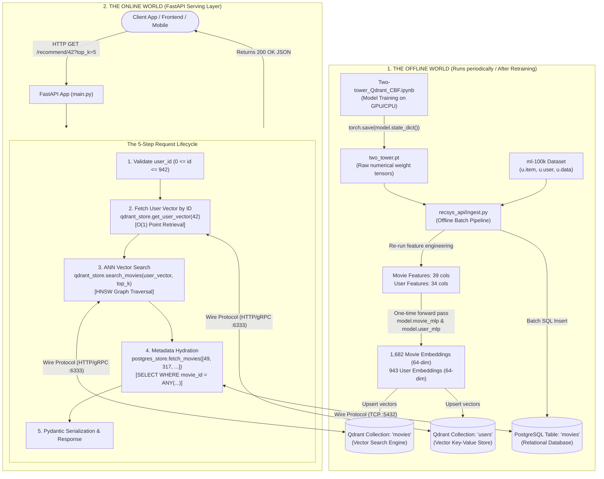

# The Complete Production RecSys Architecture & Engineering Masterclass
## Two-Tower Content-Based Filtering (CBF) with Qdrant, PostgreSQL, and FastAPI

---

## Table of Contents
1. [The Big Picture: Mental Model & Architecture](#1-the-big-picture-mental-model--architecture)
2. [What Lives Where & Why: The Multi-Database Strategy](#2-what-lives-where--why-the-multi-database-strategy)
3. [The Infrastructure Layer (`docker-compose.yml`)](#3-the-infrastructure-layer-docker-composeyml)
4. [Deep Dive 1: The Offline Ingestion Engine (`ingest.py`)](#4-deep-dive-1-the-offline-ingestion-engine-ingestpy)
   - [Why do we rebuild preprocessing and the MLP skeleton?](#why-do-we-rebuild-preprocessing-and-the-mlp-skeleton)
   - [Step-by-step code walkthrough of feature engineering](#step-by-step-code-walkthrough-of-feature-engineering)
   - [Batch inference & weight loading mechanics](#batch-inference--weight-loading-mechanics)
   - [Pushing to PostgreSQL vs. Pushing to Qdrant](#pushing-to-postgresql-vs-pushing-to-qdrant)
5. [The Core Machine Learning Question: Dot Product in PyTorch vs. Qdrant](#5-the-core-machine-learning-question-dot-product-in-pytorch-vs-qdrant)
   - [How TwoTower.forward() works during Training](#how-twotowerforward-works-during-training)
   - [Why TwoTower.forward() crashes production at scale](#why-twotowerforward-crashes-production-at-scale)
   - [How Qdrant & HNSW solve the scale barrier ($O(\log M)$ vs $O(M)$)](#how-qdrant--hnsw-solve-the-scale-barrier-olog-m-vs-om)
6. [Deep Dive 2: Asynchronous Data Access Layer (`db.py`)](#6-deep-dive-2-asynchronous-data-access-layer-dbpy)
   - [Layered Architecture: Why db.py is separated from main.py](#layered-architecture-why-dbpy-is-separated-from-mainpy)
   - [Connection Pooling vs. Per-Request Handshakes](#connection-pooling-vs-per-request-handshakes)
   - [Direct Qdrant Client interaction (`retrieve` vs `query_points`)](#direct-qdrant-client-interaction-retrieve-vs-query_points)
   - [Direct PostgreSQL interaction (`asyncpg` & batch array fetching)](#direct-postgresql-interaction-asyncpg--batch-array-fetching)
7. [Deep Dive 3: The FastAPI Serving Application (`main.py`)](#7-deep-dive-3-the-fastapi-serving-application-mainpy)
   - [The Modern Lifespan Protocol](#the-modern-lifespan-protocol)
   - [Pydantic V2 Schemas: Data contracts and serialization](#pydantic-v2-schemas-data-contracts-and-serialization)
   - [The 5-Step Request Pipeline Line-by-Line](#the-5-step-request-pipeline-line-by-line)
   - [Why `async def` and `await` matter for RecSys throughput](#why-async-def-and-await-matter-for-recsys-throughput)
8. [Production Operations: Day-to-Day Lifecycle](#8-production-operations-day-to-day-lifecycle)

---

# 1. The Big Picture: Mental Model & Architecture

In production recommendation systems, you never train models or run heavy calculations on the fly when a user clicks a button. The system is strictly divided into two distinct worlds:

1. **The Offline World (Training & Ingestion)**: Runs hours or minutes in batch. It trains neural networks, extracts static embeddings, structures metadata, and populates high-performance databases.
2. **The Online World (Serving API)**: Runs in single-digit milliseconds ($< 10\text{ ms}$). It receives a user ID, performs sub-millisecond vector indexing, hydrates metadata, and returns clean JSON to the client.



---

# 2. What Lives Where & Why: The Multi-Database Strategy

A frequent question when building your first RecSys backend is: *"Why do we need both Qdrant and PostgreSQL? Can't one database do everything?"*

Here is the exact architectural justification for separating them:

| Data Element | Storage Location | Data Type / Shape | Access Pattern | Why this specific database? |
|---|---|---|---|---|
| **Movie Embeddings** | **Qdrant** (`movies` collection) | 1,682 vectors $\times$ 64 dimensions (float32) | Approximate Nearest Neighbors (ANN) via Dot Product | Vector databases build geometric graphs (HNSW) optimized for high-dimensional spatial search. Standard SQL engines cannot traverse vector spaces in sub-millisecond time. |
| **User Embeddings** | **Qdrant** (`users` collection) | 943 vectors $\times$ 64 dimensions (float32) | Direct Point Lookup by ID ($O(1)$) | Prevents holding thousands or millions of embedding vectors in FastAPI application RAM. Stored in Qdrant as points with IDs `0...942`. |
| **Movie Metadata** | **PostgreSQL** (`movies` table) | Relational rows: `movie_id`, `title`, `release_date`, 19 genre boolean flags | Indexed Primary Key lookup (`movie_id = ANY(...)`) | Relational databases excel at ACID guarantees, structured joins, text storage, and future business rule filtering (e.g., *"Only movies after 1995"*). |

### The Two-Stage Pattern: Retrieval + Hydration
This pattern is universal across Netflix, YouTube, Spotify, and Pinterest:
1. **Candidate Retrieval (Qdrant)**: Computes vector math on millions of items at blinding speed, shedding all metadata to keep payloads small. It returns **only IDs**: `[49, 317, 131, 132, 482]`.
2. **Hydration (PostgreSQL)**: Takes the lightweight IDs from step 1 and attaches the heavy strings (titles, dates, genres, poster URLs) in a single fast indexed SQL query before sending it to the client.

---

# 3. The Infrastructure Layer (`docker-compose.yml`)

Instead of manually installing Postgres and Qdrant onto macOS, dealing with Homebrew, system permissions, background daemons, and conflicting ports, Docker encapsulates both engines inside isolated Linux containers.

```yaml
version: "3.9"

services:
  # ── 1. PostgreSQL: stores movie metadata ──────────────────────────────────
  postgres:
    image: postgres:16
    container_name: recsys_postgres
    environment:
      POSTGRES_USER: recsys
      POSTGRES_PASSWORD: recsys
      POSTGRES_DB: recsys
    ports:
      - "5432:5432"
    volumes:
      - postgres_data:/var/lib/postgresql/data
    healthcheck:
      test: ["CMD-SHELL", "pg_isready -U recsys"]
      interval: 5s
      retries: 10

  # ── 2. Qdrant: vector store for movie embeddings ──────────────────────────
  qdrant:
    image: qdrant/qdrant:latest
    container_name: recsys_qdrant
    ports:
      - "6333:6333"   # HTTP REST API
      - "6334:6334"   # gRPC API
    volumes:
      - qdrant_data:/qdrant/storage

volumes:
  postgres_data:
  qdrant_data:
```

### Critical Details:
- **Port Bindings (`5432:5432`, `6333:6333`)**: Makes the container ports accessible to your host machine. When FastAPI connects to `localhost:5432` or `localhost:6333`, Docker routes the traffic directly into the containers.
- **Named Volumes (`postgres_data`, `qdrant_data`)**: If you turn off your computer or stop the containers (`docker compose down`), the data inside Docker is **not lost**. The databases store their files inside these managed Docker volumes on your physical SSD.

---

# 4. Deep Dive 1: The Offline Ingestion Engine (`ingest.py`)

## Why do we rebuild preprocessing and the MLP skeleton?

This was one of the key questions you asked: 
> *"Why do we need all the pre-processing steps and MLP structure inside ingest even though we load the saved model from the notebook?"*

To understand this, look at what `torch.save(model.state_dict(), "two_tower.pt")` actually writes to disk.

### 1. What is inside `two_tower.pt`?
A PyTorch `state_dict` does **NOT** save Python code, dataframes, or model architecture. It is literally just an ordered Python dictionary of raw floating-point numbers:
```python
{
    "user_mlp.0.weight": Tensor of shape [128, 34], # numbers like 0.0421, -0.1982...
    "user_mlp.0.bias":   Tensor of shape [128],
    "movie_mlp.0.weight": Tensor of shape [128, 39],
    "movie_mlp.0.bias":   Tensor of shape [128],
    ...
}
```
If you hand Python just the `.pt` file, Python has **no idea what those numbers belong to**. It does not know if there are Linear layers, ReLU activations, how many layers exist, or how they connect.

Therefore, PyTorch requires you to declare the class skeleton first:
```python
# 1. Builds empty framework with random weights:
model = TwoTower(user_input_dim=34, movie_input_dim=39, embedding_dim=64)

# 2. Injects saved weights into skeleton:
model.load_state_dict(torch.load("two_tower.pt", map_location="cpu"))
model.eval()  # Pure inference mode: turns off training features like dropout/batchnorm
```

### 2. Why do we need the feature engineering steps?
Notice what was saved:
- You saved the **model parameters** (weights).
- You did **NOT** save the static `movie_embeddings` and `user_embeddings` matrices to disk!

The trained model is a mathematical function:
$$\mathbf{e}_{\text{movie}} = f_{\text{movie\_tower}}(\mathbf{x}_{\text{movie}})$$

To calculate $\mathbf{e}_{\text{movie}}$, the model needs the raw input vector $\mathbf{x}_{\text{movie}}$ (the 39 columns: genres, release year, interactions). If you don't run the preprocessing, you don't have $\mathbf{x}_{\text{movie}}$ to feed into the model!

*(Note: In `ingest.py` we included the full inference step so that whenever the underlying raw dataset updates, the pipeline can regenerate features and embeddings independently of the Jupyter Notebook).*

---

## Step-by-Step Code Walkthrough of Feature Engineering

The feature matrices produced in `ingest.py` must match the notebook down to the exact column index and dimension.

### Movie Feature Construction (39 Columns)
In `Two-tower_Qdrant_CBF.ipynb`, you engineered 3 distinct signals for movies:
1. **19 Genre Indicator Flags**: Action, Comedy, Drama, etc.
2. **1 Scaled Release Year**: Normalized using `StandardScaler` so that year values have zero mean and unit variance.
3. **19 Genre $\times$ Year Interactions**: Broadcast multiplication of each genre flag by the scaled release year. A 1950s Drama has a completely different semantic meaning than a 2010s Drama.

```python
# 1. Scaled Release Year
release_year = pd.to_numeric(movie['release_date'].str.split('-').str[-1], errors='coerce')
release_year = release_year.fillna(release_year.median())

scaler = StandardScaler()
movie['release_year_scaled'] = scaler.fit_transform(release_year.values.reshape(-1, 1))

# 2. Cross interaction
genre_array = movie[genre_cols].values                           # (1682, 19)
year_array  = movie['release_year_scaled'].values.reshape(-1, 1) # (1682, 1)
genre_year_interaction = genre_array * year_array                # (1682, 19)

# 3. Stack horizontally
movie_features = np.hstack([
    genre_array,               # 19 columns
    year_array,                # 1 column
    genre_year_interaction     # 19 columns
]).astype("float32")           # TOTAL = 39 columns!
```

### User Feature Construction (34 Columns)
Your notebook combined demographic information into a 34-dimensional feature vector:
1. **Age**: Scaled with `StandardScaler` (1 column).
2. **Gender**: Binary encoded $M=0, F=1$ (1 column).
3. **Occupation**: One-hot encoded across the 21 unique MovieLens occupations (21 columns).
4. **Zip Code Region**: Extracted the first digit of the zip code (representing geographic regions of the United States) and converted into one-hot encoding (11 columns).

```python
# 1. Gender
users["gender_idx"] = users["gender"].map({"M": 0, "F": 1})
users = users.drop(columns='gender')

# 2. Age
age_scaler = StandardScaler()
users["age"] = age_scaler.fit_transform(users[["age"]])

# 3. Occupation One-Hot (21 cols)
occ_encoder = OneHotEncoder(sparse_output=False, handle_unknown="ignore")
occ_encoded = occ_encoder.fit_transform(users[["occupation"]])
occ_cols = occ_encoder.get_feature_names_out(["occupation"])
occ_df = pd.DataFrame(occ_encoded, columns=occ_cols, index=users.index)
users = pd.concat([users, occ_df], axis=1).drop(columns='occupation')

# 4. Zip Region One-Hot (11 cols)
users['zip_region'] = users['zip_code'].astype(str).str[0]
users['zip_region'] = users['zip_region'].where(users['zip_region'].str.isdigit(), 'intl')
zip_onehot = pd.get_dummies(users['zip_region'], prefix='zip_region', dtype=int)
users = users.drop(columns=["zip_code", "zip_region"])

# 5. Stack
user_feature_cols = users.columns[1:].tolist() # Skip user_id
user_features = np.hstack([
    users[user_feature_cols].values,  # Age (1) + Gender (1) + Occupations (21) = 23
    zip_onehot.values                 # Zip Regions (11)
]).astype("float32")                  # TOTAL = 34 columns!
```

If even one column was missing, PyTorch threw the error we saw earlier:
`RuntimeError: size mismatch for user_mlp.0.weight: copying a param with shape [128, 34], shape in current model is [128, 23]`.

---

## Batch Inference & Weight Loading Mechanics

```python
def compute_embeddings(model_path, movie_features, user_features):
    movie_input_dim = movie_features.shape[1] # 39
    user_input_dim  = user_features.shape[1]  # 34

    model = TwoTower(user_input_dim, movie_input_dim, embedding_dim=64)
    model.load_state_dict(torch.load(model_path, map_location="cpu"))
    model.eval()

    with torch.no_grad(): # Critical: turns off gradient computation, freeing RAM
        movie_emb_np = (
            model.movie_mlp(torch.tensor(movie_features, dtype=torch.float32))
            .numpy()
            .astype("float32")
        )
        user_emb_np = (
            model.user_mlp(torch.tensor(user_features, dtype=torch.float32))
            .numpy()
            .astype("float32")
        )

    return movie_emb_np, user_emb_np
```

Notice that `compute_embeddings` calls `model.movie_mlp(...)` and `model.user_mlp(...)` independently! It **never calls `model.forward()`**. This is the key beauty of Two-Tower models: the towers can be decoupled completely.

---

## Pushing to PostgreSQL vs. Pushing to Qdrant

### 1. PostgreSQL Ingestion (`push_postgres`)
We create a strongly typed relational table. Notice how we handle `NaN` values in pandas: in SQL, a missing date cannot be passed as a float `NaN`, so we sanitize it to an empty string.

```python
async def push_postgres(movie: pd.DataFrame):
    conn = await asyncpg.connect(POSTGRES_DSN)

    await conn.execute("""
        CREATE TABLE IF NOT EXISTS movies (
            movie_id      INTEGER PRIMARY KEY,
            title         TEXT,
            release_date  TEXT,
            unknown       SMALLINT,
            action        SMALLINT,
            ...
        )
    """)
    await conn.execute("TRUNCATE movies")

    rows = []
    for _, row in movie.iterrows():
        release = row.get("release_date", "")
        if not isinstance(release, str):
            release = ""
        rows.append((
            int(row["movie_id"]),
            row["movie_title"],
            release,
            *(int(row[g]) for g in genre_raw),
        ))

    # Fast bulk insertion via PostgreSQL wire protocol
    await conn.executemany("""
        INSERT INTO movies VALUES ($1,$2,$3,$4,$5,$6,$7,$8,$9,$10,$11,$12,$13,$14,$15,$16,$17,$18,$19,$20,$21,$22)
    """, rows)
    await conn.close()
```

### 2. Qdrant Ingestion (`push_qdrant`)
In Qdrant, we configure the metric as `Distance.DOT` (Dot Product).

```python
def push_qdrant(movie_emb_np: np.ndarray, user_emb_np: np.ndarray):
    client = QdrantClient(host=QDRANT_HOST, port=QDRANT_PORT)

    for collection_name, embeddings in [
        (MOVIE_COLLECTION, movie_emb_np),
        (USER_COLLECTION,  user_emb_np),
    ]:
        if client.collection_exists(collection_name):
            client.delete_collection(collection_name)

        client.create_collection(
            collection_name=collection_name,
            vectors_config=VectorParams(
                size=embeddings.shape[1], # 64
                distance=Distance.DOT,    # Exact match to TwoTower dot product!
            ),
        )

        # Upload as PointStructs where point ID == movie_id / user_id
        client.upload_points(
            collection_name=collection_name,
            points=[
                PointStruct(id=i, vector=embeddings[i].tolist())
                for i in range(len(embeddings))
            ],
            wait=True,
        )
```

---

# 5. The Core Machine Learning Question: Dot Product in PyTorch vs. Qdrant

This was your second fundamental question:
> *"Why do we re-compute dot product in Qdrant even though we've done that already in the Two-tower forward()?"*

This touches the exact boundary between **Offline ML Training** and **Online Systems Engineering**.

"Learning how to create user embeddings and item embeddings in the latent space from users' features and items' features is the model's job. Retrieving top_k items for a specific user using dot product is Qdrant's job"

---

### How `TwoTower.forward()` works during Training

In your notebook, `forward()` is defined as:
```python
def forward(self, user_features, movie_features):
    user_embedding = self.user_mlp(user_features)
    movie_embedding = self.movie_mlp(movie_features)
    score = (user_embedding * movie_embedding).sum(dim=1)
    return score
```

During training, you have batches of known pairs:
- User 10 with Movie 49 (Positive, Label 1)
- User 10 with Movie 102 (Negative, Label 0)

You pass a batch of 256 pairs into the model. The model computes:
$$\text{Score} = \mathbf{u} \cdot \mathbf{v} = \sum_{i=1}^{64} u_i v_i$$
Then `BCEWithLogitsLoss` checks how close that score is to 1 or 0, computes the gradients, and updates the neural network weights.

Here, computing the dot product inside PyTorch makes total sense because you are evaluating **specific paired samples to calculate loss**.

---

### Why `TwoTower.forward()` crashes production at scale

Now imagine your app goes live in production:
- You have **1,000,000 items** (movies, products, songs).
- You have **10,000,000 registered users**.

User 42 opens the mobile app. The app wants to show them 10 recommendations.

#### What would happen if you used `TwoTower.forward()` at request time?
1. You take User 42's embedding.
2. To find the best 10 movies, you have to compute the score between User 42 and **every single movie in your entire database**:
   $$(u_{42} \cdot m_1), (u_{42} \cdot m_2), (u_{42} \cdot m_3), \dots, (u_{42} \cdot m_{1,000,000})$$
3. That is **1,000,000 dot products** (64,000,000 floating point operations) for a single user click!
4. If 500 users open the app at the exact same second:
   $$500 \times 1,000,000 = 500,000,000 \text{ dot products per second!}$$
5. Your Python process will freeze, CPU utilization will hit 100%, memory will spike, and the server will return `504 Gateway Timeout` or crash.

---

### How Qdrant & HNSW solve the scale barrier ($O(\log M)$ vs $O(M)$)

This is why **Vector Databases** exist.

Instead of comparing User 42 against every movie sequentially (a linear scan with complexity $O(M)$), Qdrant pre-indexes the movie embeddings using an algorithm called **HNSW (Hierarchical Navigable Small World)** graphs.

```
Linear Scan (Brute Force in PyTorch):
[m1] -> [m2] -> [m3] -> [m4] -> ... -> [m1,000,000]
O(M) complexity — Slow, unacceptable at scale.

HNSW Graph Navigation (Qdrant Vector Engine):
Layer 2 (Expressway):    [A] --------------------> [Z]
                          │                         │
Layer 1 (Highway):       [A] --------> [M] ------> [Z]
                          │             │           │
Layer 0 (All Points):    [A]->[B]->[C]->[M]->[N]->[Z]
O(log M) complexity — Sub-millisecond retrieval!
```

1. Qdrant builds multi-layer spatial graphs of all movie vectors.
2. When User 42's vector enters Qdrant, the search algorithm enters at the highest layer ("the expressway"), takes big spatial jumps toward the closest vector cluster, drops down layers, and pinpoints the top 10 nearest movies.
3. It examines **less than 1% of the total movies** in the database to find the top candidates.
4. Latency drops from **500ms down to 1.5ms**.

And because we configured Qdrant with `distance=Distance.DOT`, the distance metric used inside the HNSW graph is **identically equal to the dot product equation used during PyTorch training**:
$$\text{Sim}(\mathbf{u}, \mathbf{v}) = \sum_{i=1}^{64} u_i \cdot v_i$$

---

### Summary Checklist: Dot Product in Training vs. Serving

| Dimension | Training (Notebook: `TwoTower.forward()`) | Serving (Backend: Qdrant + FastAPI) |
|---|---|---|
| **Embeddings** | Generated dynamically on-the-fly per batch from raw features with gradient tracking enabled | Precomputed once offline during ingestion, statically indexed into memory |
| **Dot Product Execution** | Computed via PyTorch tensors on GPU/CPU for explicitly paired samples: `(u * v).sum(dim=1)` | Computed via Qdrant's C++/Rust vector engine across HNSW spatial graph layers |
| **Search Space** | Limited strictly to training batch pairs (e.g., 256 pairs per step) | The entire catalog of items ($M = 1,682$ or millions in production) |
| **Computational Complexity** | $O(B)$ where $B$ is batch size | $O(\log M)$ graph navigation instead of $O(M)$ brute-force linear scan |
| **Primary Goal** | **Loss & Gradient Computation**: Measure prediction error against ground truth (BCE loss) to update network weights | **Top-K Retrieval**: Return the highest-scoring recommendations to the client in $< 10\text{ ms}$ |

---

# 6. Deep Dive 2: Asynchronous Data Access Layer (`db.py`)

## Layered Architecture: Why `db.py` is separated from `main.py`

In beginner FastAPI tutorials, you often see raw database queries written right inside the endpoint functions. In production systems, we separate concerns using the **Repository Pattern**:

```
┌────────────────────────────────────────────────────────┐
│ main.py (API Layer)                                    │
│ - Handles HTTP routing, query params, status codes     │
│ - Validates input and serializes Pydantic JSON         │
│ - Knows NOTHING about SQL queries or vector metrics    │
└───────────────────────────┬────────────────────────────┘
                            │ Calls Python methods
                            ▼
┌────────────────────────────────────────────────────────┐
│ db.py (Data Access / Repository Layer)                 │
│ - Manages connection pooling and lifetimes             │
│ - Talks wire protocols: SQL (asyncpg) & gRPC (Qdrant)  │
│ - Encapsulates all query syntax and database drivers   │
└───────────────────────────┬────────────────────────────┘
                            │ TCP / Wire Protocol
                            ▼
┌────────────────────────────────────────────────────────┐
│ Databases: Qdrant (:6333) & PostgreSQL (:5432)         │
└────────────────────────────────────────────────────────┘
```

If tomorrow you decide to replace PostgreSQL with MongoDB, or Qdrant with Milvus, **you do not touch a single line of code in `main.py`**. You only change the internal implementation of `db.py`.

---

## Connection Pooling vs. Per-Request Handshakes

Why do we maintain `_pool` in `PostgresStore` instead of connecting when a request comes in?

```python
# THE WRONG WAY (Connection per request):
async def get_movies(ids):
    conn = await asyncpg.connect(...) # ❌ 30-50ms penalty per request!
    # TCP Handshake -> TLS Negotiation -> Authentication -> Process Spawn
    res = await conn.fetch(...)
    await conn.close()
    return res

# THE RIGHT WAY (Connection Pooling):
class PostgresStore:
    async def connect(self):
        self._pool = await asyncpg.create_pool(POSTGRES_DSN, min_size=5, max_size=20)

    async def fetch_movies(self, movie_ids):
        async with self._pool.acquire() as conn: # ✅ Takes 0.05ms!
            # Reuses an already-authenticated, open TCP connection
            return await conn.fetch(...)
```

---

## Direct Qdrant Client Interaction (`retrieve` vs `query_points`)

Open [`recsys_api/db.py`](recsys_api/db.py) and look at the two distinct Qdrant operations:

```python
class QdrantStore:
    async def connect(self):
        self._client = AsyncQdrantClient(host=QDRANT_HOST, port=QDRANT_PORT)

    # Operation 1: Point Retrieval (Key-Value lookup by ID)
    async def get_user_vector(self, user_id: int) -> List[float]:
        result = await self._client.retrieve(
            collection_name=USER_COLLECTION, # "users"
            ids=[user_id],
            with_vectors=True,
        )
        if not result:
            raise ValueError(f"User {user_id} not found in Qdrant.")
        return result[0].vector # Returns 64-dim float list

    # Operation 2: Vector Search (HNSW Graph Traversal)
    async def search_movies(self, user_vector: List[float], top_k: int) -> List[int]:
        results = await self._client.query_points(
            collection_name=MOVIE_COLLECTION, # "movies"
            query=user_vector,                # The 64-dim float list
            limit=top_k,
            with_payload=False,               # Payload is in Postgres!
        )
        return [int(r.id) for r in results.points]
```

### The Crucial Difference:
- `get_user_vector(user_id)` does **NOT** search. It does a direct primary key lookup in Qdrant's storage. It takes User ID `42` and immediately retrieves the 64 numbers stored for user 42. Complexity: $O(1)$.
- `search_movies(user_vector, top_k)` is a **geometric search**. It takes those 64 numbers and finds the 10 closest points in the 64-dimensional movie space. Complexity: $O(\log M)$.

---

## Direct PostgreSQL Interaction (`asyncpg` & Batch Array Fetching)

```python
class PostgresStore:
    async def fetch_movies(self, movie_ids: List[int]) -> List[Dict[str, Any]]:
        if not movie_ids:
            return []

        async with self._pool.acquire() as conn:
            rows = await conn.fetch(
                """
                SELECT movie_id, title, release_date,
                       action, adventure, animation, childrens, comedy,
                       crime, documentary, drama, fantasy, film_noir,
                       horror, musical, mystery, romance, sci_fi,
                       thriller, war, western
                FROM   movies
                WHERE  movie_id = ANY($1::int[])
                """,
                movie_ids,
            )

        # Re-sort to match the exact ranking order returned by Qdrant
        row_by_id = {r["movie_id"]: dict(r) for r in rows}
        return [row_by_id[mid] for mid in movie_ids if mid in row_by_id]
```

### Why `WHERE movie_id = ANY($1::int[])`?
- **Avoid $N+1$ Query Problem**: A beginner mistake is looping over `movie_ids` and making 10 individual SQL queries: `SELECT * FROM movies WHERE movie_id = 49`, etc. That causes 10 network round-trips.
- Passing `ANY($1::int[])` sends all 10 IDs in **a single SQL query**. PostgreSQL uses its Primary Key B-Tree index to grab all 10 rows in $< 0.5\text{ ms}$.
- **Re-sorting**: SQL databases do not guarantee that the rows returned will match the order of the input array. We construct `row_by_id` dictionary and map over `movie_ids` to ensure that movie rank #1 from Qdrant remains rank #1 in the final response.

---

# 7. Deep Dive 3: The FastAPI Serving Application (`main.py`)

## The Modern Lifespan Protocol

In older versions of FastAPI, you used `@app.on_event("startup")` and `@app.on_event("shutdown")`. In modern FastAPI, you use the standard Python **Lifespan Context Manager**:

```python
@asynccontextmanager
async def lifespan(app: FastAPI):
    # ── 1. Code before yield runs ONCE at startup ────────────────────────────
    print("🚀 Connecting to Qdrant and PostgreSQL …")
    await qdrant_store.connect()    # Initializes AsyncQdrantClient
    await postgres_store.connect()  # Creates asyncpg connection pool
    print("✅ Ready to serve requests.")

    yield  # ⏸️ The server pauses here and handles incoming user HTTP traffic!

    # ── 2. Code after yield runs ONCE on server shutdown (Ctrl+C / SIGTERM) ──
    print("🛑 Shutting down, closing connections …")
    await qdrant_store.close()
    await postgres_store.close()

app = FastAPI(..., lifespan=lifespan)
```

---

## Pydantic V2 Schemas: Data Contracts & Serialization

FastAPI uses Pydantic to enforce data typing and auto-generate OpenAPI documentation:

```python
class MovieRecommendation(BaseModel):
    movie_id:     int
    title:        str
    release_date: str
    genres:       List[str]   # Human-readable list: ["Action", "Sci-Fi"]

class RecommendResponse(BaseModel):
    user_id:      int
    top_k:        int
    recommended:  List[MovieRecommendation]
```

When you define `response_model=RecommendResponse`, FastAPI guarantees:
1. **Output Validation**: If a database column contains an unexpected type or is missing, FastAPI catches it before sending bad data to the client.
2. **Auto-Serialization**: Automatically translates Python dictionaries into valid JSON strings.
3. **Interactive Documentation**: Powers the automatic Swagger UI at `http://localhost:8000/docs`.

---

## The 5-Step Request Pipeline Line-by-Line

Look at the endpoint function inside [`main.py`](recsys_api/main.py):

```python
@app.get("/recommend/{user_id}", response_model=RecommendResponse)
async def recommend(
    user_id: int,
    top_k: int = Query(default=10, ge=1, le=500),
):
```

### Step 1: Input Validation
```python
if user_id < 0 or user_id > 942:
    raise HTTPException(status_code=400, detail=f"user_id must be between 0 and 942.")
```
Protects downstream databases from executing pointless queries on nonexistent users.

### Step 2: Fetch Precomputed User Embedding
```python
try:
    user_vector = await qdrant_store.get_user_vector(user_id)
except ValueError as e:
    raise HTTPException(status_code=404, detail=str(e))
```
FastAPI sends an async call to Qdrant to retrieve user 42's 64 float values.

### Step 3: Candidate Retrieval (ANN Search)
```python
movie_ids = await qdrant_store.search_movies(user_vector, top_k)
```
Qdrant performs dot-product HNSW search over all 1,682 movies and returns the highest scoring IDs: `[49, 317, 131, 132, 482]`.

### Step 4: Metadata Hydration from PostgreSQL
```python
movies_data = await postgres_store.fetch_movies(movie_ids)
```
PostgreSQL returns the movie titles, dates, and 19 genre columns.

### Step 5: Format & Response
```python
recommendations = [
    MovieRecommendation(
        movie_id     = row["movie_id"],
        title        = row["title"],
        release_date = row.get("release_date", ""),
        genres       = extract_genres(row),
    )
    for row in movies_data
]

return RecommendResponse(
    user_id=user_id,
    top_k=top_k,
    recommended=recommendations,
)
```
The helper function `extract_genres` converts the database flags (e.g. `action=1, sci_fi=1`) into a clean array: `["Action", "Sci-Fi"]`.

---

## Why `async def` and `await` Matter for RecSys Throughput

In standard synchronous Python (`def`):
1. Request from User A arrives.
2. Code asks Qdrant for a vector.
3. The entire Python CPU process **freezes** waiting 2ms for Qdrant to reply over the network socket.
4. While frozen, if User B makes a request, User B is blocked and has to wait in line.

In asynchronous Python (`async def` / `await`):
1. Request from User A arrives.
2. Code reaches `await qdrant_store.search_movies(...)`.
3. Python tells the operating system: *"I'm waiting for network data from Qdrant. While you wait, let me use the CPU to process User B's request!"*
4. When Qdrant's reply packets land on the network card, Python resumes User A right where it paused.
5. Result: A single Python process can easily handle **hundreds or thousands of concurrent recommendations per second**.

---

# 8. Production Operations: Day-to-Day Lifecycle

### Running the System
```bash
# 1. Start Docker containers (PostgreSQL & Qdrant daemons)
docker compose -f recsys_api/docker-compose.yml up -d

# 2. Start FastAPI application server with hot-reloading
cd recsys_api
uvicorn main:app --reload --port 8000

# 3. Test with curl
curl -s "http://localhost:8000/recommend/42?top_k=5" | python3 -m json.tool

# 4. View interactive API documentation
open http://localhost:8000/docs
```

### When to Re-Run Ingestion (`ingest.py`) vs. Normal Startup
| Situation | Need to re-run `ingest.py`? | Reason |
|---|---|---|
| **Turned off computer / Restarted laptop** | ❌ **NO** | Docker volumes (`postgres_data`, `qdrant_data`) permanently preserve data on disk. Just run `docker compose up -d` and `uvicorn`. |
| **Retrained your Two-Tower model** | ✅ **YES** | A new `two_tower.pt` means all 64-dim embeddings have changed! You must run `ingest.py` to overwrite Qdrant collections. |
| **Modified feature engineering code** | ✅ **YES** | If you alter cross-features or scaling, old embeddings become incompatible. |
| **Added new movies to the catalog** | ✅ **YES** | New items must be transformed, embedded, and indexed into both DBs. |

### Complete Clean Slate Reset
If you ever want to wipe both databases clean and re-ingest from scratch:
```bash
# -v deletes the persistent Docker volumes
docker compose -f recsys_api/docker-compose.yml down -v

# Recreate fresh empty databases
docker compose -f recsys_api/docker-compose.yml up -d

# Re-run full ingestion
python3 recsys_api/ingest.py
```
